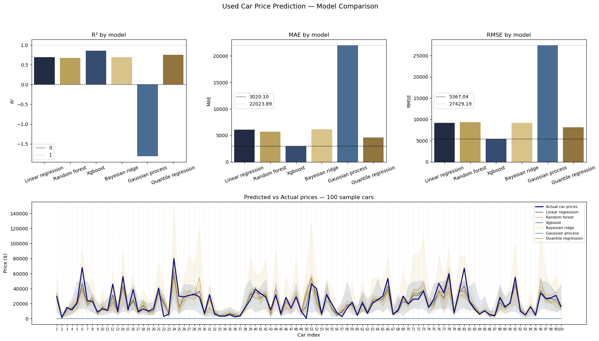

# Stochastic Predictions on Car Prices

Car prices depend on multiple factors, and used cars are far messier data-wise than brand new ones. In this project I compare multiple machine learning models — from **Linear Regression** to **Gaussian Process** and **Quantile Regression** — to find the best approach for predicting used car prices. The project also explores stochastic modelling, where instead of predicting a single exact price, the goal is to predict a realistic price range the car is likely to fall within.

---

## Data Cleaning (`reading_and_cleaning.py`)

In the data cleaning step, raw data is prepared for model training. This step is critical — higher quality input data leads to better and more reliable model performance. The following steps were taken to enhance data quality:

### Converting Condition and Title Status to Numerical Values

`condition` and `title_status` are ordinal categorical values that can be represented as integers, which models can interpret more effectively than raw strings. Both are mapped in descending order of quality — the worse the condition, the higher the number:

```python
conditionMap = {
    "new": 1,
    "like new": 2,
    "excellent": 3,
    "good": 4,
    "fair": 5,
    "salvage": 6
}

title_statusMap = {
    "clean": 1,
    "salvage": 2,
    "rebuilt": 3,
    "lien": 4,
    "missing": 5,
    "parts only": 6
}
```

### Removing Unnecessary Columns

Columns that carry no predictive value were removed to reduce noise:

| Column | Reason for removal |
|---|---|
| `county` | Missing in the vast majority of rows |
| `VIN` | Raw value not useful; only its presence matters (see below) |
| `url`, `region_url`, `image_url` | Listing metadata, not car attributes |
| `lat`, `long` | Location already represented by `region` and `state` |
| `description` | Free text with no structured signal |

### Engineering Useful Features

Some columns don't carry value in their raw form but can be transformed into meaningful features:

| Feature | Description |
|---|---|
| `vin_present` | Binary flag — a VIN confirms parts consistency and suggests no major accident history |
| `is_manufacturer_unknown` | Flags rows where manufacturer is missing, indicating a poor quality listing |
| `car_age` | Derived from model year — directly captures depreciation |
| `mileage_per_year` | Estimated annual usage (`odometer / car_age`) — high yearly mileage typically reduces value |
| `luxury_brand` | Binary flag based on a curated list of premium manufacturers — drastically increases expected price |
| `days_listed` | Derived from `posting_date` — cars listed for longer may indicate price pressure on the seller |

### Removing Rows with Unknown or Invalid Prices

Rows with missing, zero, or unrealistic prices (above \$100,000 or below \$500) were removed to focus the model on realistic private sale prices.

### Extracting Model Name and Cylinder Count from a Secondary Dataset

The car model field was a free-text input, resulting in highly inconsistent entries. Model names were normalised using fuzzy string matching (`rapidfuzz`) against a secondary reference dataset (*Car Dataset 1945–2020*), standardising entries to a clean model name.

Cylinder count is a meaningful price signal but was frequently missing or stored as a string (`"6 cylinders"`). The value was extracted as an integer and filled from the same reference dataset using the car's make and model.

---

## Model Training (`learn.py`)

Models were selected to cover a spectrum from simple interpretable baselines to stochastic uncertainty-aware predictors. The stochastic models — Bayesian Ridge, Gaussian Process, and Quantile Regression — predict a price range rather than a single value, which is the core contribution of this project.

**Models trained:**
- Linear Regression
- Random Forest
- Random Forest with bootstrap prediction interval
- XGBoost
- Bayesian Ridge
- Gaussian Process
- Quantile Regression

### Results and Notes

**Linear Regression** performed the weakest overall, which was expected — the relationship between car features and price is highly non-linear, and a straight-line model cannot capture it well. It serves as a useful baseline to measure how much the more complex models improve upon it.

**Random Forest** performed significantly better than Linear Regression. By building many independent decision trees and averaging their predictions, it captures non-linear relationships effectively. It was implemented both as a point predictor and with a bootstrap prediction interval, derived from the spread of individual tree predictions.

**XGBoost** achieved the best overall accuracy, with the lowest MAE and RMSE and the highest R². Unlike Random Forest, XGBoost builds trees sequentially — each tree corrects the errors of the previous one — which allows it to squeeze out more accuracy on structured tabular data.

**Bayesian Ridge** performed more modestly on accuracy but provides built-in uncertainty estimates on its predictions. Being a linear model, it struggles with the non-linear nature of car pricing, but its uncertainty intervals are mathematically principled rather than approximated.

**Gaussian Process** achieved the lowest accuracy of all models, with a negative R² indicating it performed worse than simply predicting the average price. This is a known limitation of Gaussian Process on high-dimensional, categorical-heavy datasets — Gaussian Process is designed for low-dimensional numerical data and struggles when the most predictive features are categorical (manufacturer, drive type, fuel). It is included to illustrate this tradeoff honestly.

**Quantile Regression** achieved the best balance between accuracy and meaningful uncertainty intervals. By training three separate XGBoost models for the 10th, 50th, and 90th percentiles, it produces tight and well-calibrated price ranges that captured the actual price in approximately 73% of cases on the 100-car sample.

### Model Comparison

| Model | MAE | RMSE | R² | Uncertainty |
|---|---|---|---|---|
| Linear Regression | ~$6,900 | ~$10,100 | 0.71 | None |
| Random Forest | ~$7,500 | ~$11,500 | 0.66 | Bootstrap |
| XGBoost | ~$3,000 | ~$5,400 | 0.86 | None |
| Bayesian Ridge | ~$6,200 | ~$9,500 | 0.70 | Yes |
| Gaussian Process | ~$22,000 | ~$27,000 | -1.60 | Yes |
| Quantile Regression | ~$4,800 | ~$7,500 | 0.78 | Yes |

---

## Dashboard (`diagrams.py`)

A summary dashboard was produced to visualise and compare model outcomes. The top row shows R², MAE, and RMSE for each model, with reference lines indicating the best and worst values. The bottom panel displays a line chart comparing predicted prices — including uncertainty bands where applicable — against the actual prices of 100 randomly selected test cars.



---